# Three-Minute Demonstration Video Guide

**Project Title:** Hospital Appointment Platform — Query Regression Detector  
**Demo Duration:** Exactly 3 Minutes (180 Seconds)  
**Target Roles:** Database Administrators (DBA), Platform Engineers, Healthcare SREs  
**Objective:** Demonstrate the end-to-end working product workflow from operational pain to automated pre-release detection, explainable evidence generation, governance review, and empirical evaluation before simulated user impact.

---

## 1. Demo Objective & Policy

### Purpose
Prove the complete end-to-end product workflow:
$$\text{Operational Pain} \longrightarrow \text{Slow Query Regression} \longrightarrow \text{Pre-Release Detection} \longrightarrow \text{Plan / Timing Comparison} \longrightarrow \text{Index / Stats Evidence} \longrightarrow \text{Release Context} \longrightarrow \text{Priority Decision} \longrightarrow \text{Evidence Review} \longrightarrow \text{Pre-Impact Detection} \longrightarrow \text{Evaluation}$$

### Mandatory Demo Claims Policy
> [!IMPORTANT]
> **SYNTHETIC DISCLOSURE POLICY:**  
> The demonstration must **NEVER** claim:
> - Real hospital deployment or real production telemetry
> - Real patient data or live Electronic Health Record (EHR) access
> - Real clinical outcomes or real-world accuracy
>
> The demonstration must **ALWAYS** use:
> - *"Synthetic experiment"*
> - *"Simulated user impact"*
> - *"Controlled prototype measurement"*
> - *"Synthetic legacy baseline"*
>
> **Canonical Statement:**  
> *"96.8% of true synthetic slow-query regressions were detected before simulated user impact."*

---

## 2. Prerequisites & Environment Setup

### Environment Configuration
Ensure Python 3.11+ is installed with repository dependencies (`requirements.txt`).  
Optionally configure demo authentication passwords in environment variables (or rely on synthetic development defaults):

```bash
# Optional environment variables (synthetic test-only credentials)
export DEMO_DBA_PASSWORD="demo-dba-synthetic-2026"
export DEMO_REVIEWER_PASSWORD="demo-reviewer-synthetic-2026"
```

### Application Startup
Start the Flask application server:

```powershell
python src/web/app.py
```
*Application URL:* `http://localhost:5000` (or `http://127.0.0.1:5000`)

### Demo Dataset Reset (Before Recording)
To ensure pristine ground-truth state before recording:
- **UI Method:** Click **🔄 Reset Demo Dataset** on the Dashboard (`#btn-reset-demo`)
- **API Method:**
  ```powershell
  curl -X POST http://localhost:5000/api/demo/reset
  ```
- **CLI Method:**
  ```powershell
  python -c "from src.web.app import _reset_demo_data; print(_reset_demo_data())"
  ```

### Demo Authentication Roles
| Role | Username | Password Source | Default Synthetic Fallback | Permitted Actions |
| :--- | :--- | :--- | :--- | :--- |
| **Platform / Database Administrator** (Primary) | `admin` | `$DEMO_DBA_PASSWORD` | `demo-dba-synthetic-2026` | Full access: rule tuning, baseline management, regression reviews, FP marking, system reset |
| **Application Reviewer** (Secondary) | `reviewer` | `$DEMO_REVIEWER_PASSWORD` | `demo-reviewer-synthetic-2026` | Read-only dashboards, triage review notes, evaluation export |

---

## 3. Demo Scenario Identification

The demonstration centers on the strongest canonical scenario already built into the system:

- **Scenario ID:** `scenario_2` / `SC-03`
- **Query ID:** `QRY-004` (`verify_slot_booked`)
- **Query Label:** *"Concurrent booking conflict scan (anti double-book)"*
- **Clinical Hazard:** Accidental index drop (`idx_appt_doctor_date`) causes slot validation query to degrade from an index lookup to a sequential table scan over 50,000 records. Latency surges from 4.6ms to 58.6ms (+1,168%), creating acute race condition hazards that cause appointment double-booking.
- **Severity Classification:** `CRITICAL` (Score: 105 / 100)
- **Pre-Impact Lead Time:** 10.0 to 12.0 minutes prior to simulated patient booking traffic.
- **Evidence Strength:** Strong multi-signal evidence with actionable remediation recommendation.

---

## 4. Timed 3-Minute Demonstration Flow

```mermaid
gantt
    title 3-Minute Video Timeline (180s)
    dateFormat  X
    axisFormat %s s
    section Problem & Baseline
    Problem Context & Dashboard        :0, 20
    Synthetic Baseline vs Target       :20, 45
    section Detection & Forensics
    Find Highest Priority Regression   :45, 75
    Why Did It Regress? (Plan Diff)    :75, 105
    section Governance & Evidence
    Forensic Evidence & Review Action  :105, 125
    section Measurable Results
    Evaluation & Lead Time (96.8%)     :125, 150
    Error Analysis (FP/FN)             :150, 165
    Privacy & Conclusion               :165, 180
```



---

### [0:00 – 0:20] 1. Problem Context
- **Screen:** Web Dashboard (`http://localhost:5000/dashboard`)
- **Visual:** Show header *"Hospital Query Regression Detector"*, KPI banner, and system status.
- **Narration:**
  > *"Hospital appointment platforms cannot tolerate double booking or unpredictable query slowdowns. When critical scheduling queries degrade after a release, concurrent booking transactions conflict and patients get assigned the same slot.*  
  > *Traditional reactive monitoring alerts engineers only after users complain. This working prototype detects query regressions before simulated user impact."*

---

### [0:20 – 0:45] 2. Baseline Comparison
- **Screen:** Dashboard KPI Cards / Pre-Impact Section (`http://localhost:5000/dashboard` or `/evaluation`)
- **Visual:** Highlight comparison metrics banner:
  - Synthetic Legacy Baseline: **0.0%** pre-impact (20.7% reactive post-impact)
  - Project Target: **90.0%**
  - Measured Detector: **96.8%**
- **Narration:**
  > *"The prototype compares a synthetic legacy reactive-monitoring baseline with our automated pre-release detector.*  
  > *In this synthetic experiment, the legacy baseline caught zero percent of regressions before simulated user impact, whereas our detector achieved 96.8 percent—well surpassing our 90 percent target."*

---

### [0:45 – 1:15] 3. Find the Regression
- **Screen:** Interactive Demo Scenarios & Recent Regressions table on Dashboard
- **Visual:** Locate `scenario_2` / `QRY-004`. Click `▶ Run Scenario Demo` or click `QRY-004` in the table.
- **Highlighted Fields:**
  - Query ID: `QRY-004`
  - Query Name: *Verify Appointment Slot Booked (Double-Booking Check)*
  - Severity: `CRITICAL`
  - Priority Score: `105`
  - Execution Time Change: `+1168.5%` (4.6ms $\rightarrow$ 58.6ms)
- **Narration:**
  > *"Here the detector identifies a high-priority regression before simulated clinical traffic reaches the affected query.*  
  > *Notice Query `QRY-004`, which performs anti-double-booking slot verification. It is flagged CRITICAL with a latency surge of over eleven hundred percent."*

---

### [1:15 – 1:45] 4. Why Did It Regress?
- **Screen:** Query Forensics Detail Page (`http://localhost:5000/query/QRY-004`)
- **Visual:** Scroll to the **WHAT CHANGED? (Root Cause Summary)** and **Before vs After Quantitative Shifts** cards:
  1. *Execution Time:* Baseline 4.6ms vs Current 58.6ms
  2. *Plan Cost:* Index scan vs Full table scan
  3. *Index Information:* Lost `idx_appt_doctor_date`
  4. *Statistics & Workload:* Table cardinality and concurrent load
  5. *Release Context:* Tagged in release `v1.1`
- **Narration:**
  > *"The system does not simply say that the query became slow. It provides evidence explaining what changed.*  
  > *Under 'WHAT CHANGED', we see root-cause attribution: the execution plan degraded because the supporting index `idx_appt_doctor_date` was dropped during release v1.1. The database optimizer was forced into a full table scan across 50,000 appointments."*

---

### [1:45 – 2:05] 5. Evidence + Governance Review
- **Screen:** Query Forensics Lower Section (`http://localhost:5000/query/QRY-004`)
- **Visual:** Show structured multi-signal evidence, rule triggers, and the Review Form.  
  Demonstrate typing a short note: *"Index drop confirmed; rolling back release v1.1"* and clicking **⚠️ Confirm Regression** (or **👁️ Acknowledge / Under Review**). Show the audit trail update.
- **Narration:**
  > *"Every high-priority result is backed by structured evidence across seventeen checked dimensions. An authorized administrator or reviewer can inspect the evidence and record a review decision.*  
  > *Here, the DBA confirms the regression, preventing a broken release from reaching clinical users, while creating an immutable audit record."*

---

### [2:05 – 2:30] 6. Measurable Evaluation Results
- **Screen:** Evaluation Page (`http://localhost:5000/evaluation`)
- **Visual:** Highlight Confusion Matrix and Core Success Metrics:
  - Total Ground-Truth Records: **814**
  - True Regressions: **251**
  - True Positives (TP): **243**
  - False Negatives (FN): **8**
  - False Positives (FP): **157**
  - True Negatives (TN): **406**
  - Recall: **96.8%** | Precision: **60.8%** | F1-Score: **74.7%**
  - Average Lead Time: **13.1 minutes**
- **Narration:**
  > *"The evaluation uses ground-truth synthetic scenarios rather than a manually selected accuracy number.*  
  > *Out of 251 true regressions in our synthetic benchmark, 243 were detected before simulated user impact, giving 96.8 percent, compared to the 90 percent target.*  
  > *The average detection lead time was 13.1 minutes before simulated clinical impact."*

---

### [2:30 – 2:45] 7. Error Analysis (FP / FN)
- **Screen:** Evaluation Page Error Analysis Section (`http://localhost:5000/evaluation#error-analysis`)
- **Visual:** Display False Positive ($N=157$) and False Negative ($N=8$) breakdowns and Threshold Sensitivity table.
- **Narration:**
  > *"The prototype also inspects errors instead of hiding them. False positives and false negatives are explicitly reported so threshold trade-offs can be evaluated.*  
  > *Most false positives were transient workload surges where execution plans remained intact, and configurable thresholds allow teams to balance sensitivity against alert fatigue."*

---

### [2:45 – 3:00] 8. Privacy & Conclusion
- **Screen:** Navigation footer / Privacy Assumptions modal / Terminal zero-PII confirmation
- **Visual:** Show Zero-PII certification note (`PA-002 Certified`) and final system summary.
- **Narration:**
  > *"The prototype uses synthetic or anonymised data and does not use real patient records. The measured result is from a controlled synthetic experiment.*  
  > *The result is an end-to-end working query-regression detection prototype that identifies slow-query regressions before simulated user impact, with configurable rules, evidence-backed investigation, role-based access, and measurable evaluation."*

---

## 5. Verified Demonstration Values

All values shown in the demonstration are mathematically verified against the active benchmark database:

| Metric | Target Value | Measured Value | Synthetic Legacy Baseline |
| :--- | :---: | :---: | :---: |
| **Total Synthetic Records** | — | **814** | 814 |
| **True Regressions** | — | **251** | 251 |
| **True Positives (TP)** | — | **243** | 0 (pre) / 52 (post) |
| **False Negatives (FN)** | — | **8** | 251 |
| **False Positives (FP)** | — | **157** | 0 |
| **True Negatives (TN)** | — | **406** | 563 |
| **Pre-Impact Detection Rate** | $\ge \mathbf{90.0\%}$ | $\mathbf{96.8\%}$ (96.81%) | **0.0%** (20.7% post-impact) |
| **Average Lead Time** | $\ge 10.0\text{ min}$ | **13.1 min** (Median 16.0 min) | 0.0 min |
| **High-Priority Evidence Completeness** | $100.0\%$ | **100.0%** (398 / 398 records) | 0.0% |
| **Automated Test Suite** | 100% Pass | **160 / 160 passing** | — |

---

## 6. Deterministic Backup Demonstration Path

If the browser or local web server is interrupted during a recording session, execute the deterministic command-line demonstration:

```powershell
# Step 1: Execute reproducible CLI evaluation benchmark
python src/detector.py evaluate

# Step 2: Query key verification metric directly
python -c "from src.core.evaluation_engine import evaluate_ground_truth_dataset; r=evaluate_ground_truth_dataset(); print('Pre-Impact:', r['core_success_metric']['measured_detector_pct'], '% | Lead Time:', r['core_success_metric']['lead_time_minutes']['average'], 'min')"

# Step 3: Run interactive demo scenario 2 verification
python -c "from src.web.app import _execute_demo_scenario; print(_execute_demo_scenario('scenario_2')['result']['classification'])"
```
*Expected CLI output:*
- `Pre-Impact: 96.8 % | Lead Time: 13.1 min`
- `CRITICAL`

---

## 7. Recording Checklist

Before pressing record:
- [ ] Run demo reset: `POST http://localhost:5000/api/demo/reset`
- [ ] Verify web server is running: `http://localhost:5000`
- [ ] Log in as Database Administrator (`admin` / `$DEMO_DBA_PASSWORD` or fallback)
- [ ] Verify Dashboard loads with KPI banner visible
- [ ] Confirm Query `QRY-004` appears in Recent Regressions
- [ ] Test drill-down link to `/query/QRY-004`
- [ ] Confirm "WHAT CHANGED?" card renders with Before/After visual bars
- [ ] Confirm Review Form is functional (non-destructive review)
- [ ] Open Evaluation page at `/evaluation`
- [ ] Confirm Confusion Matrix displays $243 / 157 / 406 / 8$
- [ ] Confirm 96.8% measured vs 90.0% target is clearly readable
- [ ] Confirm False Positive / False Negative analysis is visible
- [ ] Rehearse narration timing with a stopwatch:
  - 0:00–0:20: Problem
  - 0:20–0:45: Baseline
  - 0:45–1:15: Find Regression
  - 1:15–1:45: Why Did It Regress?
  - 1:45–2:05: Evidence & Review
  - 2:05–2:30: Evaluation (96.8%)
  - 2:30–2:45: Error Analysis
  - 2:45–3:00: Privacy & Conclusion
- [ ] Stop recording at exactly 3:00 (180s)
