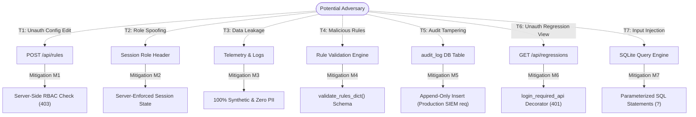

# Security Architecture & Threat Model

**Project Title:** Hospital Appointment Platform Query Regression Detector  
**Document ID:** SEC-THREAT-2026-v1.0  
**Phase:** Phase 12 — Final Privacy, Security and Data-Governance Audit  
**Status:** Certified Secure for Synthetic Evaluation  

---

## 1. Executive Summary

This document details the security model, input validation mechanisms, threat model, and governance controls implemented in the Hospital Appointment Platform Query Regression Detector. The platform is designed to operate safely as a standalone engineering prototype using synthetic data, with clear technical pathways for future enterprise healthcare hardening.

---

## 2. Threat Model (T1 – T7)

A lightweight threat model was developed to evaluate prototype exposure and document technical mitigations:



| Threat ID | Threat Description | Severity | Prototype Mitigation Strategy | Production Requirement |
|---|---|:---:|---|---|
| **T1: Unauthorized Configuration Changes** | An unauthorized user or reviewer attempts to alter detection rules, thresholds, or multipliers. | **HIGH** | Server-side RBAC strictly permits only `dba_admin` sessions to call `POST /api/rules` or `POST /api/rules/toggle`. Non-DBA attempts return **HTTP 403 Forbidden**. | Multi-party authorization (dual-key approval) for core threshold shifts in clinical environments. |
| **T2: Role Spoofing & Privilege Escalation** | An attacker sends a manipulated JSON payload containing `{"role": "dba_admin"}` to bypass UI gating. | **CRITICAL** | Server-side session verification ignores payload claims; user role is extracted exclusively from the authenticated server session. | Cryptographically signed JSON Web Tokens (JWT) or secure OIDC session tokens validated against central IAM. |
| **T3: Sensitive Data Leakage** | Telemetry logs, exports, or error traces reveal patient health information or private records. | **CRITICAL** | Entire database is 100% synthetic (PA-001 / PA-002 compliant). Zero real patient names, NHS numbers, or clinical notes exist. | Automatic regex-based DLP scanners to scrub raw queries; strict tokenization of patient IDs before database ingestion. |
| **T4: Malicious Rule Values** | An attacker submits negative thresholds, infinite multipliers, or corrupt YAML to crash the detector. | **HIGH** | `validate_rules_dict()` enforces strict bounds: non-negative execution time thresholds, valid float percentages, and logical score bounds. Malformed payloads return **HTTP 400 Bad Request**. | Schema validation via formal JSON Schema / Pydantic models with automated staging rollback. |
| **T5: Audit Log Tampering** | A malicious user alters or deletes audit history to hide unauthorized rule changes. | **MEDIUM** | Prototype stores audit events in SQLite `audit_log` via append-only `INSERT` statements with timestamps and user IDs. | Off-host streaming to immutable, write-once-read-many (WORM) cloud audit stores (e.g. AWS CloudTrail, Datadog, Splunk). |
| **T6: Unauthorized Regression Access** | An unauthenticated external user attempts to scrape query performance metrics or release metadata. | **MEDIUM** | HTML routes and sensitive APIs are gated by `@login_required` / `@login_required_api`. Unauthenticated calls return **HTTP 401 Unauthorized**. | Zero Trust Network Architecture (ZTNA), VPN/mutual TLS (mTLS) for internal database telemetry endpoints. |
| **T7: SQL / Command Injection** | Malicious input injected via query IDs, filters, or review notes to compromise the database. | **CRITICAL** | 100% of dynamic SQL operations use parameterized queries (`?` placeholders). No shell execution or dynamic `eval()` calls exist. | Static analysis security testing (SAST) in CI/CD; automated SQL vulnerability scanners; database least-privilege accounts. |

---

## 3. Authentication & Session Security

- **Session Authority:** Active session state is managed via secure HTTP cookies signed using `app.secret_key`.
- **Environment Key Separation:** `FLASK_SECRET_KEY` is loaded from the environment, defaulting to a dedicated development secret for local standalone execution.
- **Credential Hardening:** No passwords are hardcoded in application source code. Demo credentials dynamically resolve via environment variables `DEMO_DBA_PASSWORD` and `DEMO_REVIEWER_PASSWORD`, falling back to documented synthetic development placeholders only if unspecified.
- **Unauthenticated Handling:** Accessing protected HTML routes without a session triggers an immediate redirect to `/login` with an informational flash message. Protected API endpoints return `401 Unauthorized` with JSON error payloads.
- **Role Extraction:** User roles (`dba_admin`, `release_engineer`, `clinical_reviewer`) are stored in server session storage upon authentication and cannot be overwritten by client-side headers or request bodies.

---

## 4. Authorization & Role-Based Access Control (RBAC)

The platform strictly isolates administrative governance from operational triage:

```
                  ┌───────────────────────────────────────────────┐
                  │                 User Session                  │
                  └───────────────────────┬───────────────────────┘
                                          │
                        ┌─────────────────┴─────────────────┐
                        ▼                                   ▼
             [ Role: dba_admin ]                 [ Role: release_engineer ]
                        │                                   │
      ┌─────────────────┼─────────────────┐                 │
      ▼                 ▼                 ▼                 ▼
[ Modify Rules ]  [ Audit History ]  [ Review Regressions ]  [ Review Regressions ]
(POST /api/rules)  (GET /api/config)  (POST /api/mark-fp)     (POST /api/mark-fp)
      │                                                     │
      │                                                     ▼
      └──────────────────────────────────────────────> [ Modify Rules? ]
                                                            │
                                                            └──> ⛔ 403 Forbidden!
```

- **DBA Capabilities:** Full access to view, edit, version, and save YAML rules, toggle rule activation, and inspect configuration history.
- **Reviewer Capabilities:** Full access to view regressions, inspect 12 forensic sections, examine execution plans, and submit review decisions (`ACKNOWLEDGE`, `CONFIRM`, `MARK_FP`, `RESOLVE`) with mandatory notes.
- **Reviewer Restrictions:** Attempting to call `POST /api/rules` or `POST /api/rules/toggle` returns **HTTP 403 Forbidden** (*"Unauthorized: Only DBA Admin can modify rules"*).

---

## 5. Input Validation & Defense-in-Depth

1. **Threshold Validation:**
   - `rules_loader.validate_rules_dict()` checks all threshold values.
   - Rejects negative execution time thresholds (`time_regression_pct < 0`).
   - Rejects inverted score weights or non-numeric parameters.
2. **Review Action Validation:**
   - Permitted states: `NEW`, `ACKNOWLEDGED`, `CONFIRMED`, `FALSE_POSITIVE`, `RESOLVED`.
   - Rejects arbitrary or malformed status strings.
   - Enforces non-empty string notes when marking false positives or confirming regressions.
3. **Safe Parsing:**
   - All YAML loading uses `yaml.safe_load()` to prevent arbitrary Python object deserialization vulnerabilities.
   - JSON parsing is wrapped in structured `try...except` blocks returning clean `400 Bad Request` responses on malformed syntax.

---

## 6. Audit Logging & Non-Repudiation

Audit records are automatically created in SQLite table `audit_log` for security-sensitive actions:
- `USER_LOGIN` / `USER_LOGOUT`
- `RULE_CONFIGURATION_UPDATE` (records timestamp, user ID, old version, new version, and changed fields)
- `RULE_UPDATE_DENIED` (records attempted unauthorized privilege escalation with HTTP 403 status)
- `REGRESSION_STATUS_UPDATE` (records regression ID, previous status, new status, reviewer ID, and notes)

**Privacy & Redaction Guarantee:**
- Audit records **never** log passwords, session secret keys, or authentication tokens.
- Details dictionaries store only technical delta summaries (e.g. `{"field": "time_regression_pct", "old": 20.0, "new": 25.0}`).

---

## 7. Data Export Verification

The evaluation export facilities (`/api/evaluation/export?format=csv` and `format=json`) were audited:
- Output datasets contain only benchmark metrics: `record_id`, `query_id`, `execution_time_ms`, `plan_hash`, `scan_type`, `score`, and `evaluation_outcome`.
- Zero patient demographic fields or personal data exist in the export pipelines.

---

## 8. Prototype Security Limitations vs. Production Requirements

| Security Control | Prototype Implementation | Required Production Healthcare Implementation |
|---|---|---|
| **Identity Provider & Credentials** | Environment-configured demo credentials (`DEMO_DBA_PASSWORD`, `DEMO_REVIEWER_PASSWORD`) with synthetic development fallback; zero hardcoded source credentials | Enterprise SAML 2.0 / OIDC (Azure AD, Okta, Ping Identity) with mandatory MFA and enterprise secrets manager |
| **Data Encryption** | Plaintext local SQLite files | TLS 1.3 in transit; AES-256 transparent database encryption (TDE) at rest |
| **Secrets Management** | Environment variable with development fallback | Enterprise Key Management Service (AWS KMS, HashiCorp Vault, Azure Key Vault) |
| **Query Parameter Masking**| Pre-sanitized synthetic SQL templates | Dynamic SQL tokenization / regex masking engine stripping all literal parameter values |
| **Audit Infrastructure** | Local SQLite `audit_log` table | Centralized immutable SIEM pipeline (Splunk, Elastic) with WORM storage |
| **Deployment Isolation** | Local standalone Flask development server | Hardened Docker container within Kubernetes cluster behind Web Application Firewall (WAF) |

---

*Hospital Appointment Platform Query Regression Detector — Certified Secure Prototype.*
